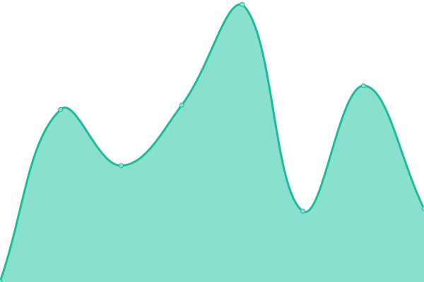

# [📈 Live Status](https://upptime.github.io/upptime): <!--live status--> **🟩 All systems operational**

This repository contains the open-source uptime monitor and status page for [Upptime](https://upptime.js.org), powered by [Upptime](https://github.com/upptime/upptime).

With [Upptime](https://upptime.js.org), you can get your own unlimited and free uptime monitor and status page, powered entirely by a GitHub repository. We use [Issues](https://github.com/upptime/upptime/issues) as incident reports, [Actions](https://github.com/Zero-To-One-Dev/status-page-zto/actions) as uptime monitors, and [Pages](https://upptime.github.io/upptime) for the status page.

<!--start: status pages-->
<!-- This summary is generated by Upptime (https://github.com/upptime/upptime) -->
<!-- Do not edit this manually, your changes will be overwritten -->
<!-- prettier-ignore -->
| URL | Status | History | Response Time | Uptime |
| --- | ------ | ------- | ------------- | ------ |
|  [Vibrosculpt](https://vibrosculpt.com) | 🟩 Up | [vibrosculpt.yml](https://github.com/Zero-To-One-Dev/status-page-zto/commits/HEAD/history/vibrosculpt.yml) | 

 558ms
     
 | 

<a href="https://Zero-To-One-Dev.github.io/status-page-zto/history/vibrosculpt">100.00%</a>
    

|  [Dr. Ming](https://www.drmingtea.com) | 🟩 Up | [dr-ming.yml](https://github.com/Zero-To-One-Dev/status-page-zto/commits/HEAD/history/dr-ming.yml) | 

 674ms
     
 | 

<a href="https://Zero-To-One-Dev.github.io/status-page-zto/history/dr-ming">100.00%</a>
    

|  [Copper Slim](https://www.copperslim.com) | 🟩 Up | [copper-slim.yml](https://github.com/Zero-To-One-Dev/status-page-zto/commits/HEAD/history/copper-slim.yml) | 

 794ms
     
 | 

<a href="https://Zero-To-One-Dev.github.io/status-page-zto/history/copper-slim">100.00%</a>
    

|  [Hot Shappers](https://www.hotshapers.com) | 🟩 Up | [hot-shappers.yml](https://github.com/Zero-To-One-Dev/status-page-zto/commits/HEAD/history/hot-shappers.yml) | 

 1994ms
     
 | 

<a href="https://Zero-To-One-Dev.github.io/status-page-zto/history/hot-shappers">100.00%</a>
    

|  [Hot Vita](https://hotvita.com) | 🟩 Up | [hot-vita.yml](https://github.com/Zero-To-One-Dev/status-page-zto/commits/HEAD/history/hot-vita.yml) | 

 700ms
     
 | 

<a href="https://Zero-To-One-Dev.github.io/status-page-zto/history/hot-vita">100.00%</a>
    

<!--end: status pages-->

[**Visit our status website →**](https://upptime.github.io/upptime)

## 📄 License

- Powered by: [Upptime](https://github.com/upptime/upptime)
- Code: [MIT](./LICENSE) © [Upptime](https://upptime.js.org)
- Data in the `./history` directory: [Open Database License](https://opendatacommons.org/licenses/odbl/1-0/)
